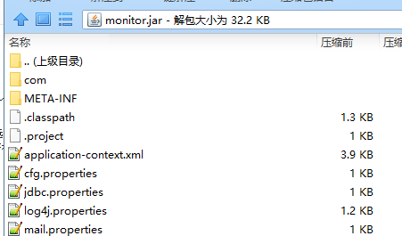

# export jar

### 导出jar

#### 依赖的jar包存放目录

在需要运行的jar包同目录下新建“lib”目录（放在一个目录里面好看些），然后把所需的jar包都扔进去

#### 使用eclipse导出jar后修改（或在导出过程中选择写好的）“MANIFEST.MF”

如下：在填写Class-Path时，除了第一行，后面的所有行都需要**空两个空格**

```text
Manifest-Version: 1.0
Class-Path: lib\activation-1.1.jar
  lib\aopalliance-1.0.jar
  lib\asm-3.3.1.jar
  lib\cglib-2.2.2.jar
Main-Class: com.timanetworks.workflow.monitor.App
```

#### 程序中从classpath中获取的配置文件，都需要放到运行的jar的根目录

如图 



#### 在使用string.format的时候，“%s”后面不要使用“\n”，这应该是个bug

#### 若需要在运行的jar所在目录创建文件，直接写文件名即可

如：在log4j.properties里面配置“log4j.appender.file.path=logs/”、  
“log4j.appender.R0.File=${log4j.appender.file.path}err.log”  
则logs/err.log就会在jar运行的当前目录被创建

#### 使用maven导出所引用的jar

对工程右键，然后run as，选择maven build  
然后在goals填写 dependency:copy-dependencies

