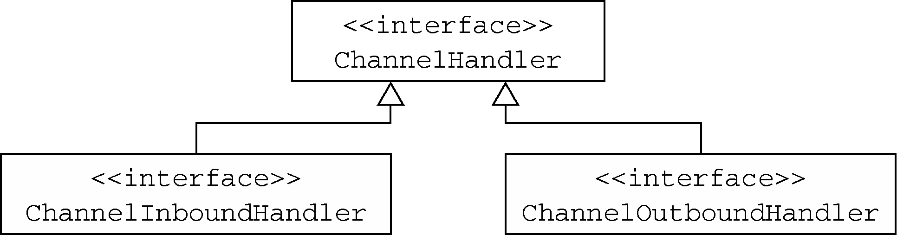
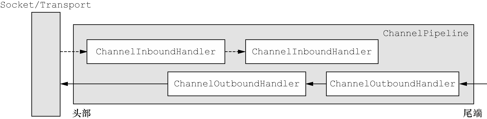

# ChannelPipeline

ChannelPipeline 提供了 ChannelHandler 链的容器，并定义了用于在该链上传播入站 和出站事件流的 API。当 Channel 被创建时，它会被自动地分配到它专属的 ChannelPipeline。 ChannelHandler 安装到 ChannelPipeline 中的过程如下所示：&#x20;

&#x20;一个ChannelInitializer的实现被注册到了ServerBootstrap中 ①；&#x20;

&#x20;当 ChannelInitializer.initChannel()方法被调用时，ChannelInitializer 将在 ChannelPipeline 中安装一组自定义的 ChannelHandler；&#x20;

&#x20;ChannelInitializer 将它自己从 ChannelPipeline 中移除。 为了审查发送或者接收数据时将会发生什么，让我们来更加深入地研究 ChannelPipeline 和 ChannelHandler 之间的共生关系吧。 ChannelHandler 是专为支持广泛的用途而设计的，可以将它看作是处理往来 Channel

Pipeline 事件（包括数据）的任何代码的通用容器。图 3-2 说明了这一点，其展示了从 Channel

Handler 派生的 ChannelInboundHandler 和 ChannelOutboundHandler 接口。

使得事件流经 ChannelPipeline 是 ChannelHandler 的工作，它们是在应用程序的初 始化或者引导阶段被安装的。这些对象接收事件、执行它们所实现的处理逻辑，并将数据传递给 链中的下一个 ChannelHandler。它们的执行顺序是由它们被添加的顺序所决定的。实际上， 被我们称为 ChannelPipeline 的是这些 ChannelHandler 的编排顺序。 图 3-3 说明了一个 Netty 应用程序中入站和出站数据流之间的区别。从一个客户端应用程序 的角度来看，如果事件的运动方向是从客户端到服务器端，那么我们称这些事件为出站的，反之 则称为入站的。

① 或者用于客户端的 Bootstrap。——译者注

