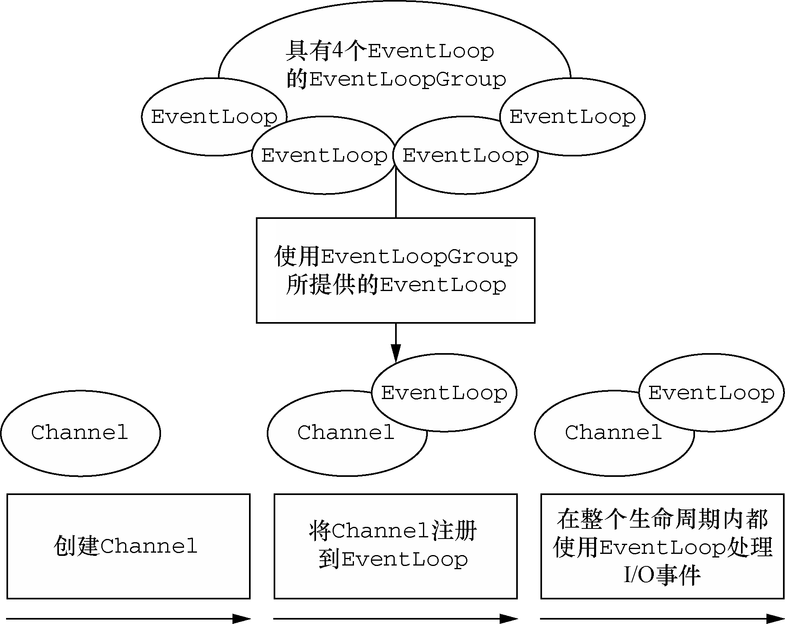

# EventLoop

EventLoop常用实现类NioEventLoop类关系如图

.png>)

服务端代码通常如下，会使用一个BossEventLoopGroup和一个WorkerEventLoopGroup，一个BossEventLoopGroup对应多个WorkerEventLoopGroup。new NioEventLoopGroup()的时候会创建多个EventLoop。BossEventLoopGroup和WorkerEventLoopGroup互不影响，BossEventLoopGroup处理“Accept”事件，WorkerEventLoopGroup负责和客户端

ServerBootStrap会通过以下代码，添加一个叫做ServerBootstrapAcceptor的ChannelHandler，在“Accept”到客户端连接的时候，会创建一个SocketChannel用于和客户端交互，并在调用ServerBootstrapAcceptor的channelRead()的时候作为消息传入，在channelRead方法中会调用childGroup（WorkerEventLoopGroup）的register()，childGroup.register()又会调用next().register()，next()会

```java
@Override
void init(Channel channel) {
    setChannelOptions(channel, newOptionsArray(), logger);
    setAttributes(channel, newAttributesArray());

    ChannelPipeline p = channel.pipeline();

    final EventLoopGroup currentChildGroup = childGroup;
    final ChannelHandler currentChildHandler = childHandler;
    final Entry<ChannelOption<?>, Object>[] currentChildOptions = newOptionsArray(childOptions);
    final Entry<AttributeKey<?>, Object>[] currentChildAttrs = newAttributesArray(childAttrs);

    p.addLast(new ChannelInitializer<Channel>() {
        @Override
        public void initChannel(final Channel ch) {
            final ChannelPipeline pipeline = ch.pipeline();
            ChannelHandler handler = config.handler();
            if (handler != null) {
                pipeline.addLast(handler);
            }

            ch.eventLoop().execute(new Runnable() {
                @Override
                public void run() {
                    pipeline.addLast(new ServerBootstrapAcceptor(
                            ch, currentChildGroup, currentChildHandler, currentChildOptions, currentChildAttrs));
                }
            });
        }
    });
}
```

```java
@Override
@SuppressWarnings("unchecked")
public void channelRead(ChannelHandlerContext ctx, Object msg) {
    final Channel child = (Channel) msg;

    child.pipeline().addLast(childHandler);

    setChannelOptions(child, childOptions, logger);
    setAttributes(child, childAttrs);

    try {
        childGroup.register(child).addListener(new ChannelFutureListener() {
            @Override
            public void operationComplete(ChannelFuture future) throws Exception {
                if (!future.isSuccess()) {
                    forceClose(child, future.cause());
                }
            }
        });
    } catch (Throwable t) {
        forceClose(child, t);
    }
}
```


在初始化的时候会一次预先创建多个WorkerEventLoopGroup作为“Accept”事件后ChildChannel的EventLoopGroup

```java
EventLoopGroup bossGroup = new NioEventLoopGroup();
EventLoopGroup workerGroup = new NioEventLoopGroup();
try {
    ServerBootstrap b = new ServerBootstrap();
    b.group(bossGroup, workerGroup)
            .channel(NioServerSocketChannel.class)
            .childHandler(new ChannelInitializer<SocketChannel>() {
                @Override
                public void initChannel(SocketChannel ch) {
                    ch.pipeline().addLast(xxxHandler);
                }
            });

    ChannelFuture f = b.bind(port).sync();
    f.channel().closeFuture().sync();
} finally {
    workerGroup.shutdownGracefully();
    bossGroup.shutdownGracefully();
}
```


EventLoop 定义了 Netty 的核心抽象，用于处理连接的生命周期中所发生的事件。我们将 在第 7 章中结合 Netty 的线程处理模型的上下文对 EventLoop 进行详细的讨论。目前，图 3-1 在高层次上说明了 Channel、EventLoop、Thread 以及 EventLoopGroup 之间的关系。



这些关系是：

一个 EventLoopGroup 包含一个或者多个 EventLoop；&#x20;

&#x20;一个 EventLoop 在它的生命周期内只和一个 Thread 绑定；&#x20;

&#x20;所有由 EventLoop 处理的 I/O 事件都将在它专有的 Thread 上被处理；&#x20;

&#x20;一个 Channel 在它的生命周期内只注册于一个 EventLoop；&#x20;

&#x20;一个 EventLoop 可能会被分配给一个或多个 Channel。 注意，在这种设计中，一个给定 Channel 的 I/O 操作都是由相同的 Thread 执行的，实际 上消除了对于同步的需要。
